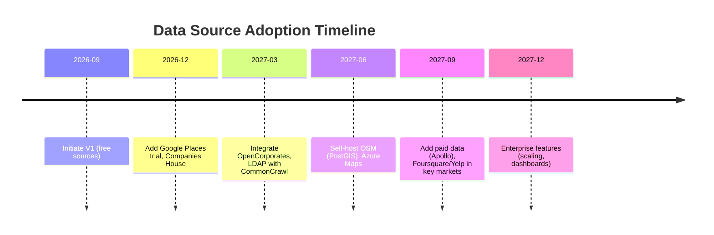

# Executive Summary 

Multiple free and open sources can supply business and POI data for an ICP-driven lead-finder.  We identify options in four categories: **Map/POI APIs** (e.g. OpenStreetMap/Overpass, Google/Bing free tiers, Yelp/Foursquare limited tiers), **Business registry databases** (e.g. UK Companies House, OpenCorporates), **Open web data** (Common Crawl, Wikidata, government open data), and **Social/Tech signals** (GitHub, WHOIS, etc.). Each source has tradeoffs in coverage, query limits, data fields, licensing and cost. 

For a V1 MVP in India and abroad, we recommend *starting with a small stack of safe, free sources*: primarily **OpenStreetMap/Overpass** (global POI data), **public company registries** (e.g. UK Companies House, OpenCorporates), and *ad hoc* **web search/websites** (crawling target company sites).  These offer useful company/location data with minimal legal risk (OSM is CC-ODbL but free to use, Companies House data is OGL).  Tier-1 global providers like Google Places and Bing Maps have generous free credits, but require billing accounts and have usage limits (e.g. Google provides $200/month credit).  Local directories or scraped sources (Justdial, LinkedIn, etc.) often forbid scraping and should be avoided for a compliant product. 

In summary, focus first on *free, reliable APIs and datasets*, and only later migrate to paid or self-hosted solutions as needed.  A phased roadmap (see below) might start with Overpass+OSM and government data, then add Google/Bing trials and large web datasets (CommonCrawl), and finally scale to paid data (Apollo, Google Maps premium). 

**Table: Recommended Free/Safe Data Sources**  

| Source              | Coverage       | Key fields                      | Limits/Notes                          | License / Terms                                     |
|---------------------|----------------|---------------------------------|---------------------------------------|-----------------------------------------------------|
| **OpenStreetMap / Overpass** | Global POIs  | Name, address, category (tags), coordinates, contact info (if present: website, phone, email, opening hours, etc.) | ~10,000 req/day per IP recommended; two public servers (~1M req/day each). Tools like Overpass Turbo or APIs (e.g. Nominatim for search) exist. | **ODbL** (requires attribution and share-alike). Highly stable (community-run). No anti-scrape issues (open). |
| **Nominatim (OSM geocoding)** | Global (addresses/places) | Forward/reverse geocoding (lat/lng), place names, OSM object IDs, types (amenity, shop, etc.), bounding box | Rate-limit ~1 req/sec per IP on public API; heavy use requires local install. | Data = OSM (ODbL). Must include `User-Agent` and follow Nominatim usage policy (no heavy scraping). |
| **Google Places API (free tier)** | Global        | Business name, address, types, user ratings, contact info, website, attributes (hours, price level), Place IDs | $200 monthly credit per account (roughly 40k–50k free calls for basic queries). Must enable billing and API key. Strict terms of service (no redistributing raw data). | Proprietary (maps.google.com/data). Allowed for “allowed uses” under Google TOS (requires key, billing). Response data cannot be freely redistributed; use only as API. |
| **Bing Maps / Azure Maps** | Global        | Similar to Google: POI search, geocoding, routing, imagery | Free Basic key: 125k transactions/year (internal), or 50k/day (public apps). Must register for key. New Azure Maps on Azure subscription. | Proprietary Microsoft terms. Free tier limited, requires key. Use with attribution if needed. |
| **Yelp Fusion API** | US, CA, UK, AU | Business listings (esp. restaurants/shops), ratings, review counts, categories, location coordinates | Free tier: ~300 API calls/day (Starter Plan). Uses OAuth key.  Additional quota by application. Strict rate limits (daily and QPS). | Proprietary. Only use official API (scraping Yelp violates Terms). Limited geographic coverage (mostly US/Canada). |
| **Foursquare Places API** | Global        | Venue name, category, address, check-ins/popularity metrics | Free credit ($200/month) ~30–40k calls. Rate limit 50 QPS for free accounts. | Proprietary. Official API only. Good for urban venue data. |
| **Companies House API** | UK             | Company name, number, status, registration date, address, SIC codes, filing history, officers | 600 requests per 5 minutes (free). Data returned in JSON. | **Open Government Licence (UK)** – free use with attribution. Official and accurate for UK companies. |
| **OpenCorporates API** | Global (~200M companies) | Company name, jurisdiction, number, address, officers, filings, website, local registry links | Free for non-commercial open-data use (with share-alike license). Commercial API starts at £225/mo (500 calls). | Open (share-alike CC BY-SA/ODbL-like) for open projects. For proprietary use, must purchase API access. |
| **Common Crawl**    | Global web (~300B pages) | Raw HTML content, text of websites, links.   | Completely free, massive dataset. No query API – use URL/CDX indexes or download WARC segments via S3 or HTTP. Requires big-data processing (Hadoop/Spark etc.). | Terms of Use allow research use of crawled data. Not explicitly licensed; assume CC-0 style access to *crawled text*. Must respect original copyrights. High maintenance cost (compute/storage). |
| **Wikidata**       | Global notable entities | Structured data on companies (industry, country, coordinates, website, descriptions, etc.) | Unlimited API access but SPARQL endpoint throttled by query complexity. Data export CC0 (public domain). | CC0 (no restrictions). Very safe legally. Coverage limited to notable/covered entities. |
| **Government Registries** | e.g. MCA India, SEC (USA), Bloomberg BVD, etc. | Official business registration data | Varies by country. E.g. UK Companies House above. US SEC EDGAR (public cos). India’s MCA (paid/web login, no free API). Many have search portals; no open APIs in most. | Often open or pay-per-use (e.g. SEC EDGAR is public domain, UK CH OGL). India’s registry data is not openly accessible. |
| **Other Sources (to avoid)** | e.g. Yellow Pages, Justdial, LinkedIn, Facebook, etc. | | Usually have strict no-scraping rules (TOS forbid automated harvesting). | We **do not recommend scraping these** – risk of IP bans and legal issues. E.g. Justdial’s ToS explicitly bans automated data collection.  

## Source Evaluations 

- **OpenStreetMap / Overpass API:**  Global coverage of *physical* POIs (shops, clinics, restaurants, offices, etc.).  Useful tags include `amenity`, `shop`, `office`, etc., plus optional fields like `website`, `phone`, `email`, `opening_hours`, `addr:*`.  For example, in Phoenix an Overpass query (`amenity=dentist`) found ~600 dental clinics (≈40% had websites).  Public Overpass servers allow moderate use (~10k requests/day recommended), but heavy use requires hosting your own instance or using paid tiers (Geofabrik, private.coffee, etc. available).  Data license: **ODbL** – can be used commercially if you attribute OpenStreetMap and share-derived data under the same license.  No anti-scraping issues since it’s an open API, and maintenance is low (community-run).  

- **Nominatim (OpenStreetMap search/geocode):**  Free geocoding and place search for addresses/POIs.  Can be used to translate names to coordinates or vice versa.  Limited to ~1 request/second on public servers.  Also ODbL data.  Useful for standardizing addresses or reverse-geocoding leads.  

- **Google Maps/Places (free tier):**  Excellent global coverage and data richness.  With a Google Cloud account you get $200/month credit (roughly 40k text/nearby searches).  Features like Places Text Search or Nearby Search can find businesses by query and location.  **Drawback:** requires billing account and API key, and usage beyond the free credit incurs charges.  Also under Google’s proprietary license (results can’t be publicly redistributed).  Best as a supplemental source, not as sole strategy.  

- **Bing Maps / Azure Maps:**  Comparable global data (POI search, geocoding).  Microsoft provides a free “Basic” key with up to ~125k transactions/year (depending on app type).  Data returned in JSON.  Migrating to Azure Maps (on Azure subscription) is recommended as Bing’s Enterprise APIs retire by 2028.  Coverage is decent (especially US, Europe), and terms are permissive for development.  

- **Yelp Fusion API:**  Focused on restaurants, shops, service businesses.  In practice, strong in US/Canada and expanding (UK, AU, etc.).  Free tier is tiny (300 searches per day).  Rate-limits are strict (daily and per-second).  Use only via official API; Yelp’s TOS forbids scraping its site.  Data returned includes name, address, phone, rating, categories, review counts, price level.  Good for US local businesses, weak elsewhere.  

- **Foursquare Places API:**  Broad global coverage of places (venues, attractions, stores).  Up to ~$200/mo credit yields ~30–40k calls.  Rate limit ~50 QPS on free plan.  Data includes name, address, categories, and popularity metrics.  Also requires a developer account and respects Foursquare’s terms.  

- **UK Companies House API:**  (Example of an official business registry API.)  Covers all companies registered in the UK.  Offers JSON data: company details, officers, filings, etc.  Rate limit: 600 calls per 5 min (substantial).  License: **Open Government Licence** (free to use with attribution).  Very reliable for UK market; limited to UK entity coverage.  

- **OpenCorporates API:**  Aggregates global company registries (200M+ entities).  Provides company details, officers, and links to source filings.  Free tier exists for non-commercial *open data* use (with share-alike, attribution).  Commercial use requires subscription (starts ~$225/month).  API rate limits and data coverage vary by jurisdiction, but it is one of the largest corp data sources.  Note: as open/CC-by-SA data, any derivatives (like a compiled lead list) would need to be shared alike if distributed.  

- **Common Crawl:**  A massive open repository of web pages (billions of sites).  No query API, but an index (CDX/URL) lets you find pages; actual data (WARCs) can be downloaded via Amazon S3 or HTTP.  All content (text, HTML) is freely accessible.  **Use-case:** Mine company websites at scale (e.g. extract tech stacks, hiring pages, marketing copy, etc.).  Requires heavy compute (Hadoop/EMR or crawler).  License: CC-BY style open use (Common Crawl insists on obeying robots.txt and content rights but generally encourages open research).  Not real-time (monthly dumps) and complex to use, but invaluable for bulk text analysis or avoiding live crawling.  

- **Wikidata:**  Free, crowd-sourced knowledge graph (CC0).  Contains structured facts on notable companies, orgs, people, etc.  Query via SPARQL or dumps.  Data (e.g. industry, country, HQ, official website, number of employees) is limited to entities Wikipedia-like (so large or notable companies).  Very low risk (public domain), no rate-limits beyond SPARQL query policy.  Good for semantic enrichment or validating company attributes.  

- **Government Open Data & Registries (others):**  e.g. US SEC EDGAR (public companies filings, free), data.gov (various business datasets), local chambers, etc.  Coverage is patchy: often only large/public firms, or requiring special access.  India’s MCA has a search portal, but no free bulk API.  Any government data usually carries open licences (OGL or CC0).  

- **Social/Tech Signals:**  Platforms like LinkedIn, Facebook, Instagram have rich business info but forbid scraping (and their APIs are closed or limited).  Tools like GitHub API or BuiltWith can hint at a company’s tech stack (e.g. public repos or site analysis), but again limited.  WHOIS (domain registration) APIs can sometimes yield owner/registrant names and creation dates (useful for small businesses).  Use these only with their official, free interfaces and heed privacy rules.  

**Terms and Anti-Scraping Notes:**  Many data sources explicitly prohibit scraping their websites. For example, **Justdial/IndiaMART** forbid automated data collection in their TOS (avoid using scraped data without permission).  LinkedIn, Facebook, Yelp, and Google search results all ban bots.  Always use official APIs or open data portals.  

## Data Quality and Coverage by Region 

- **OpenStreetMap:** Very strong in US/Europe/Australia, improving in India, SEA, and UAE but still gaps.  Some cities (e.g. Bangalore, Mumbai) have good POI tagging, others less.  For India, OSM has limited completeness (few highways, but many local shops are mapped).  OSM yields *some* leads in all regions, but be prepared to supplement in areas of sparse mapping (e.g. use Google/Bing or local directories).  (OSM example: “Bengaluru dentist” query finds many clinics.)  

- **Google/Bing/Azure Maps:** Excellent global coverage.  Google likely has the most comprehensive listing of businesses, including small ones.  Bing/Azure is comparable for major cities but may miss some rural outlets.  Both cover India, UAE, SEA, etc., but like most sources, have stronger data in developed markets.  

- **Yelp/Foursquare:** Yelp is primarily North America and some Western markets (US, Canada, UK, Australia, parts of Asia like Japan, India are very weak or non-existent on Yelp).  Foursquare is more global (it was a local app worldwide), but skewed to urban venues (cafes, shops).  Neither is strong for rural or enterprise B2B listings.  

- **Companies House:** Only UK companies.  If your ICP is local businesses in UK, it’s gold; elsewhere irrelevant.  

- **OpenCorporates:** Very broad country coverage (200M+ companies).  For India, it includes many companies (though may miss small firms not in official registries).  It covers most countries with registries (India, US, UK, EU, Singapore, etc.), but data quality depends on source (India data may be sparser than UK).  

- **Common Crawl:** Coverage reflects the open web.  It will contain company websites from any region with a web presence.  Likely good coverage of English-language or major web hosts; may under-represent smaller local sites in, say, rural India or closed countries.  

- **Wikidata:** Very biased to notable entities (public companies, large NGOs, etc.).  It contains some SMEs if someone added them, but not reliable for general SMB leads.  Best for major co’s in US, Europe, UAE, etc.  

- **Government data:** UK companies (excellent, OGL).  US SEC (public companies).  EU has national registers (e.g. Austria’s Firmenbuch, Netherlands KvK) but often no unified free API.  India’s business registry has no easy open API (some scraped “DIPP” lists of FDI-approved firms are public).  SEA/Australia may have some business census data, but often not specific company lists.  

**Summary:** For India+Global leads, OSM covers the wide base (free but patchy in some regions), supplemented by search/Places in gaps. Use Companies House/OpenCorporates for formal B2B data, and Common Crawl/web search to fetch details from websites. Avoid relying solely on any one country’s open data except UK’s high-quality Companies House.  

## Recommended V1 Stack and Roadmap 

### V1 (Proof of Concept – free sources)
- **OpenStreetMap/Overpass:** Global lead discovery (in India and other markets). Query by ICP (category+location) to get candidate list. Example Overpass query (Bangalore dentists): 
  ```sql
  [out:json][timeout:25];
  area[name="Bengaluru"]->.a;
  (
    node["amenity"="dentist"](area.a);
    way["amenity"="dentist"](area.a);
    relation["amenity"="dentist"](area.a);
  );
  out center tags;
  ```
  This returns JSON with each object’s `tags` (e.g. `name`, `website`, `phone`, `addr:*`), plus center coordinates.  

- **Local web search (Google/Bing/Site search):** Manually or via allowed APIs find business names or websites matching your ICP phrases (e.g. “dental clinic Bangalore”). Use free SERP facade if available (e.g. [DuckDuckGo Instant API](https://api.duckduckgo.com) can return limited results, or custom Google CSE).  

- **Company websites crawl:** For each discovered candidate, crawl their website (at least homepage, /contact, /about). Extract signals: number of locations (e.g. from addresses or “Locations” page), online booking (contact forms or booking widgets), tech stack (using libraries like [builtwith-python](https://github.com/nielstron/builtwith) or Wappalyzer), content cues (blog activity, pricing, services list).  Stage your crawl: start with homepage & robots.txt, then deeper pages only if needed.  

- **UK Companies House API:** If your ICP includes UK businesses, call CH API for any matching names to get official data (company status, SIC codes, officers). Rate limit is 600/5min, which is ample.  

- **Wikidata SPARQL (optional):** For large targets, fetch structured data via SPARQL query like:
  ```sparql
  SELECT ?company ?companyLabel ?industry ?countryName WHERE {
    ?company wdt:P31 wd:Q4830453;   # instance of business
             wdt:P17 ?country.
    ?company wdt:P452 ?industry.
    ?company wdt:P856 ?website.
    FILTER(CONTAINS(LCASE(?industryLabel),"tech") || CONTAINS(LCASE(?industryLabel),"software"))
    SERVICE wikibase:label { bd:serviceParam wikibase:language "en". }
  }
  ```
  This finds notable tech companies by country. Use CC0 data.  

**V1 Output:** A merged, deduplicated list of ~50–100 qualified leads.  
- **Deduplication:** Normalize names (strip Inc./Ltd, punctuation), addresses (via geocode), phones. Cluster by geo-proximity. Use fuzzy string matching (e.g. Levenshtein or Jaro-Winkler) to merge duplicates. Keep highest-quality record per business.  

**V2 (Scaling up / region expansion):**  
- Add **Google Places Text/Nearby Search** (use free credit). Gives more leads (especially in regions where OSM is thin). Apply field masks to only get needed fields.  
- Integrate **OpenCorporates**: search companies by name/industry for global coverage. Get formal data (incorporation date, etc.) but track share-alike license requirements (use only for internal scoring, not exposed raw).  
- Use **Common Crawl**: query its CDX index for the top candidate websites and download relevant pages. Extract job openings, tech mentions, and other fresh signals without live crawling (reduces throttling risk). For example, a job listing can be a buying signal (“looking for a marketing manager”).  
- Optionally try **Yelp/Foursquare** in specific markets (e.g. US or where Yelp is strong) to fill any local gaps.  

**V3 (Production / advanced):**  
- **Self-host OSM + Overpass:** Deploy your own Overpass instance (using OSM planet or regional extracts) with PostGIS backend. This removes rate limits and lets you build spatial indexes tuned to your ICP (e.g. by country/industry).  
- **Shift to paid data for scale:** e.g. subscribe to Google Maps/Places pay-as-you-go when free credit is exhausted; consider enterprise leads databases (Apollo, ZoomInfo) if budget allows.  
- **Full Agency OS features:** Multi-tenant isolation, dashboards, automated outreach (WhatsApp API, email sequencing), etc.  

**Roadmap (Mermaid timeline):**  



## Source Comparison 

| Source            | Regions            | Key Fields                                          | License/Cost (free tier)    | Query Limits / Notes                           |
|-------------------|--------------------|-----------------------------------------------------|-----------------------------|------------------------------------------------|
| **OSM/Overpass**  | Global             | `name`, `addr:*`, `amenity`/`shop`/`office`, `website`, `phone`, coordinates, ratings (if mapped) | Free (ODbL; must attribute) | Public API: ~10k req/day/IP. Use Overpass QL. Good reliability, no login needed. |
| **Google Places** | Global             | Business name, address, types, phone, hours, rating, website, PlaceID   | $200/mo credit (pay-as-you-go) | High-quality data, needs billing. Rate-limit by SKU.  |
| **Bing Maps/Azure** | Global         | Location, address, POI data, geocode                   | Free tier (~125k Tx/yr) | Reliable geocoding/POI. Use REST with key. Migration to Azure Maps planned. |
| **Yelp Fusion**   | US/CA/UK/AU        | Business (category, ratings, review_count, etc.)    | Free 300/day (Starter)        | Strict daily QPS (429 on exceed). Use only API. |
| **Foursquare**    | Global             | Venue (categories, popularity, address)             | ~$200/mo (~30k calls) | 50 QPS limit on free. Requires token.           |
| **Companies House** | UK              | Company name, status, address, SIC code, officers   | Free (OGL)            | 600 req/5min. JSON data.           |
| **OpenCorporates**| Global             | Company (jurisdiction, number, address, officers)   | Free for open projects (share-alike) | Rate-limit by plan (free ≈1000/mo?). Attribution required if data reused. |
| **Common Crawl**  | Global (web)       | Raw HTML/text of sites, links, etc.                 | Free (open crawl)      | Massive; no API. Use CDX index or AWS S3. No rate-limit, but huge storage/compute needed. |
| **Wikidata**      | Global             | Structured data (industry, country, website, etc.)  | CC0 (public domain) | SPARQL endpoint (max 30s/query). Instant (in-memory DB).  |
| **Others to Avoid** | (Local directories) | Various          | Proprietary            | Terms forbid scraping (e.g. Justdial).            |

## Integration Notes 

- **Overpass Example:** A query to find businesses in a region. E.g. for dental clinics in Bengaluru:
  ```sql
  [out:json][timeout:30];
  area[name="Bengaluru"]->.searchArea;
  (
    node["amenity"="dentist"](area.searchArea);
    way["amenity"="dentist"](area.searchArea);
  );
  out center tags;
  ```
  The JSON output includes each element’s `tags` (fields like `name`, `addr:street`, `website`, `phone`, etc.) and `lat`/`lon` coordinates.  (Adjust category and location by ICP.)  

- **Companies House API:**  E.g. `GET https://api.company-information.service.gov.uk/search/companies?q=dental+Bangalore` (with API key).  Returns JSON list of matching companies with numbers, then fetch details via `/company/{number}`.  

- **Common Crawl:**  Use the **URL Index (CDX)** to find pages by domain. For instance, query `index.commoncrawl.org/CC-MAIN-2023-17-index?url=example.com/*&output=json` to get WARC references for that domain, then fetch pages via `https://data.commoncrawl.org/...`.  Parse HTML for emails, phone numbers, tech tags.  

- **Crawling Strategy:**  *Stage 1:* Fetch homepage and parse key info (contact email/phone, known locations, tech by script tags). *Stage 2:* If ICP-match uncertain, fetch secondary pages (`/about`, `/services`, `/contact`, `/careers`). *Stage 3:* If still unclear, mark or discard.  Use user-agent and respect robots.txt as per best practice (though for data extraction you control your bot behavior).  

- **Deduplication Heuristics:**  After gathering candidates from all sources, merge by: 
  1. Exact match on unique ID (like Companies House number or OpenStreetMap OSM ID).  
  2. Fuzzy name + address match: normalize names (lowercase, remove “Pvt Ltd”, special chars), normalize addresses (via Google Geocode or simple street name matching).  If two records share very close lat/lng and similar names, treat as duplicate. 
  3. Phone or domain match: identical phone or website domain implies same entity. 
  Keep one record per business, preserving most complete data.  

- **Legal/Licensing Checklist:**  
  - For OSM-derived data: provide attribution (“© OpenStreetMap contributors”) in any output or interface.   If distributing the raw compiled database of OSM data, note it triggers ODbL share-alike.  (However, using it internally to generate leads may not require publishing the entire dataset.)  
  - For OpenCorporates: if using their free data, you must attribute OpenCorporates and share any republished data under a compatible license. 
  - For any scraped content: ensure compliance with robots.txt (Common Crawl obeyed robots.txt). Don’t extract personal data (emails of private individuals) or any copyright content beyond what’s needed for business info (names, job title, company info is usually fair game).  
  - Avoid **explicit scraping of forbidden sites**. For example, do not scrape Google’s HTML results pages; use official APIs. Do not scrape LinkedIn pages. If using Yelp data, strictly use their Fusion API with a valid key.  

- **Example Overpass Output Fields:**  
  From an Overpass query you might get, per element: 
  ```json
  {
    "type":"node",
    "id":12345,
    "lat":12.9716,
    "lon":77.5946,
    "tags":{
      "amenity":"dentist",
      "name":"SmileCare Dental",
      "addr:street":"MG Road",
      "addr:city":"Bengaluru",
      "website":"http://smilecare.example.com",
      "phone":"+91-80-12345678",
      "opening_hours":"Mo-Fr 09:00-18:00",
      "rating":"4.5"
    }
  }
  ```
  Fields of interest are **`name`, `website`, `phone`, `addr:*`, `amenity/shop/office`**, plus `lat`/`lon`.  (Not all records have all fields.)

## Sources to Avoid 

- **Paid Scraping Services:** E.g. Apify, BrightData etc are paid and might rely on proxies to scrape. We focus on free/open for now.  
- **Closed Platforms (LinkedIn, Facebook):** Do *not* attempt to scrape personal pages or use non-public APIs. Even searching company pages on LinkedIn would violate their terms.  
- **Local Directories with TOS (Justdial, IndiaMART, Yellowpages):** These have rules against scraping. Unless you can license their data, skip them. (We explicitly **do not** include Justdial/IndiaMART in the free sources list.)  

## Conclusion 

By combining a handful of open and free data sources, you can build a credible pipeline of ICP-qualified leads before investing in paid data.  Start with **OpenStreetMap (Overpass)** as your primary discovery engine – it’s free, global, and surprisingly rich – then enrich/verify with **web crawls** and **public registries** (e.g. Companies House, Wikidata).  Track which signals actually predict customer interest, then consider paid APIs (Apollo, Google Maps) only to fill the gaps.  This staged approach minimizes cost and risk, while building a defensible, share-alike‐friendly lead database.  

**Sources:** We have cited official documentation and domain-specific analyses for usage limits and licensing (e.g. Overpass usage, Yelp API limits, Companies House policy, OpenCorporates licensing, Google billing, Wikidata CC0, Extractly case study on OSM). These guide the above recommendations on feasibility, compliance, and data quality. 

